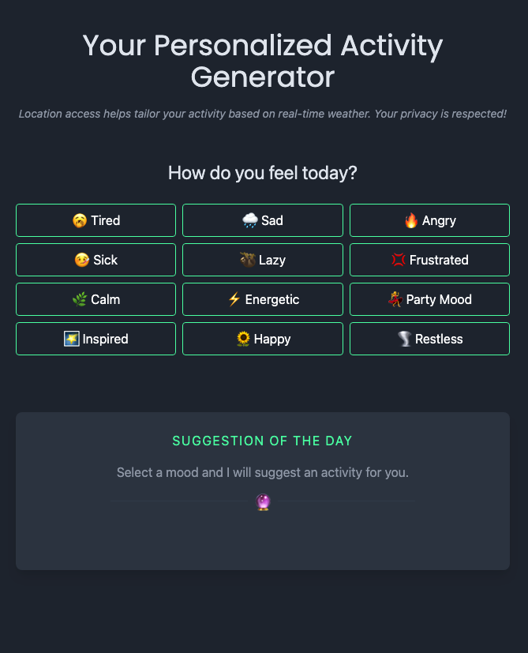

# Moodcast

**Moodcast** is a single-page application (SPA) that provides personalized activity recommendations based on the user's **current weather conditions** and **mood**. It leverages the OpenWeatherMap API to fetch real-time weather data and the OpenAI API to generate relevant activity suggestions.

## Features

- **Geolocation-based Weather Fetching** : Users grant location access to retrieve real-time weather data.
- **Mood Selection** : Users choose their mood for the day from predefined options.
- **AI-powered Activity Suggestions** : OpenAI generates personalized activity ideas based on weather and mood.
- **Seamless UI** : Built with Vue.js and styled using Tailwind CSS.
- **Optimized Performance** ⚡: Uses Vite for fast development and build processes.
- **Deployed on Netlify** : Secure API calls using environment variables.

## Tech Stack

- **Frontend**: Vue.js 3
- **Styling**: Tailwind CSS
- **Bundler**: Vite
- **APIs Used**:
  - [OpenWeatherMap API](https://openweathermap.org/api) (for weather data)
  - [OpenAI API](https://openai.com/) (for activity suggestions)
- **Deployment**: Netlify (with serverless functions to secure API keys)

## Screenshots



## Installation & Setup

### 1️ Clone the Repository

```sh
git clone https://github.com/your-github-username/moodcast.git
cd moodcast
```

### 2️⃣ Install Dependencies

```sh
npm install
```

### 3️⃣ Create a `.env` File (Local Development)

```sh
touch .env
```

Add the following environment variables to `.env`:

```sh
VITE_WEATHER_API_KEY=your_openweathermap_api_key
VITE_OPENAI_API_KEY=your_openai_api_key
```

### 4️⃣ Start the Development Server

```sh
npm run dev
```

### 5️⃣ Build for Production

```sh
npm run build
```

## Deployment

### **Live Demo**

https://moodcast.netlify.app/

### **Deploying to Netlify**

1. Push your project to GitHub.
2. Create a **new site** on [Netlify](https://www.netlify.com/).
3. Link your repository.
4. Add your environment variables (`VITE_WEATHER_API_KEY`, `VITE_OPENAI_API_KEY`) in Netlify settings.
5. Deploy and share!

## Project Structure

```plaintext
├── src
│   ├── components
│   │   ├── Weather.vue  # Handles fetching and displaying weather data
│   │   ├── Mood.vue     # Handles user mood selection
│   │   ├── Activity.vue # Fetches AI-generated activity suggestions
│   ├── App.vue         # Main application layout
│   ├── main.js         # Vue app entry point
├── public              # Static assets
├── .env                # Environment variables (not committed to GitHub)
├── package.json        # Dependencies and scripts
├── vite.config.js      # Vite configuration
```

## API Integration

### **Fetching Weather Data**

```js
const apiKey = import.meta.env.VITE_WEATHER_API_KEY;
const weatherApiUrl = `https://api.openweathermap.org/data/2.5/weather?lat=${lat}&lon=${lon}&appid=${apiKey}`;
fetch(weatherApiUrl)
  .then((response) => response.json())
  .then((data) => console.log(data));
```

### **Fetching AI Activity Suggestions**

```js
const openAiApiKey = import.meta.env.VITE_OPENAI_API_KEY;
const prompt = `Suggest an activity for someone feeling ${mood} on a ${weatherCondition} day.`;
const response = await fetch('https://api.openai.com/v1/completions', {
  method: 'POST',
  headers: {
    Authorization: `Bearer ${openAiApiKey}`,
    'Content-Type': 'application/json',
  },
  body: JSON.stringify({ prompt, model: 'text-davinci-003' }),
});
const data = await response.json();
console.log(data.choices[0].text);
```

## Future Enhancements

- **Customizable Moods**: Let users add their own mood categories.
- **More Weather Conditions**: Enhance AI prompts to handle complex weather patterns.
- **UI Improvements**: Better mobile responsiveness.

## Acknowledgments

- OpenWeatherMap API for weather data
- OpenAI API for AI-powered suggestions
- Vue.js and Tailwind CSS for a modern frontend framework

---

**Interested in collaborating?** Feel free to open an issue or a pull request!
